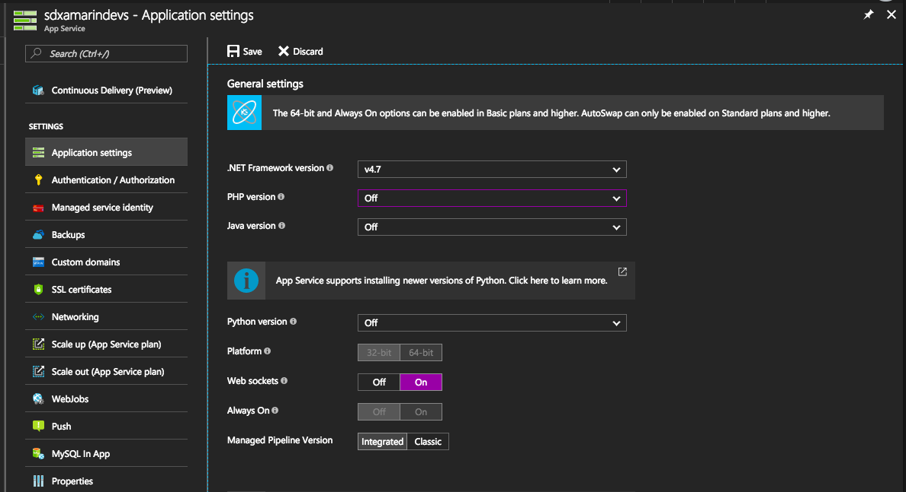
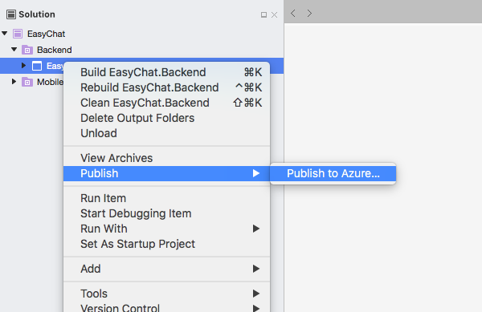
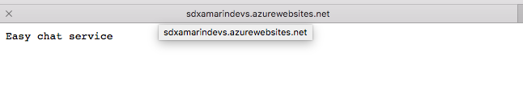
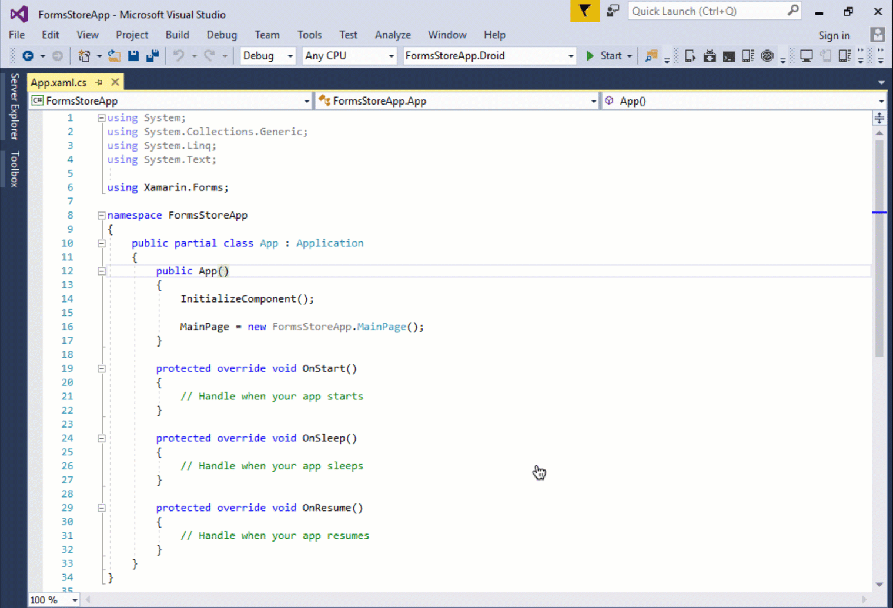

# San Diego Xamarin Dev's Hackathon - January 2018

The app in this Hackathon is a modification from the Easy Chat app discussed in [Developing Real-Time Communication Apps with WebSocket](https://blog.xamarin.com/developing-real-time-communication-apps-with-websocket/). This Hackathon will cover:

- Working with Web Sockets
- Deploying a Web Application to an Azure App Service
- Modular App Design using Prism Modularity in Prism 7
- Getting setup with CI/Nightly Builds for Xamarin and Prism
- Updating the app to use the newly supported CSS StyleSheets in Xamarin Forms vNext
- Using an Azure Functions App

## Level 0

- Create an App Service on Azure. (Note that this can be on a Free App Service Plan)
- Navigate to the App Service's `Application settings`
  - Turn off PHP (we don't need it)
  - Turn on Web Sockets

When you're done you should see something like:



- Open the EasyChat.sln in Visual Studio 2017 or Visual Studio for Mac
- Build the EasyChat.Backend project to make sure everything is working
- Deploy EasyChat.Backend to the Azure App Service that you created



Once Visual Studio has finished deploying the web project to Azure, it should open your browser and you should see something like the following:



NOTE: If it does not open your browser you can browse the site from the Azure Portal

## Level 1

With the Backend up on Azure update `EasyChat/Helpers/AppConstants.WebSocketHost` to point to your newly deployed backend.

Build and deploy the project on two different devices. This could be your phone and a simulator on your laptop or each member of your team's phones.

Send messages back and forth.

## Level 2

Let's add some CSS styles to our project. In order to do this we'll need Xamarin Forms vNext which isn't on NuGet. To do this we'll need to add the Xamarin Forms Nightly Build Feed. We can do this one of two ways:

1. Add the Package Source in Visual Studio. This is a great method however when we do this we are limited to supporting projects within our Development Environment. 
1. Add a `NuGet.config` to solution directory. When we open our Solution Visual Studio will automatically pick this up and use any feeds defined in the `NuGet.config`. This also provides the benefit that when another developer checks out the code they will not have any additional configuration to build the solution. We also have the benefit of being able to use this config in a Build system like VSTS or AppCenter.

```xml
<?xml version="1.0" encoding="utf-8"?>
<configuration>
  <packageSources>
    <clear />
    <add key="Prism-CI" value="https://www.myget.org/F/prism/api/v3/index.json" />
    <add key="Xamarin-Nightly" value="https://www.myget.org/F/xamarinforms-ci/api/v3/index.json" />
    <add key="NuGet.org" value="https://api.nuget.org/v3/index.json" />
  </packageSources>
</configuration>
```

### Add CSS

- Update to the latest Xamarin Nightly Build
- Add a CSS style sheet to style the Incoming and Outgoing Message Cells
  - Be sure to look at the Styles in App.xaml so you can see how to model the styles
  - Add your css to the css file in `EasyChat\Style\style.css`
  - Be sure to check out the [CSS Cheat Sheet](CSS-Cheat-Sheet.md)
- Add the StyleSheetHelper in the starter directory to `EasyChat\Helpers`
- Be sure to use the Helper to Get the current css when the user authenticates (hint: look in App.xaml.cs)
- Update the SettingsPageViewModel so that when a value is updated it will update the cached css file
- Update the `IncomingMessage.xaml.cs` and `OutgoingMessage.xaml.cs` as shown below:

```cs
public partial IncomingMessage : ViewCell
{
  public IncomingMessage()
  {
    InitializeComponent();
    // Add this line to the ctor
    View.Resources.Add(Helpers.StyleSheetHelper.GetStyleSheet());
  }
}
```

## Boss Level

- Copy your css file to the Backend project's `wwwroot` folder and tokenize the background color for the Incomming and Outgoing frames.
- With the tokenized css file added, redeploy the Backend to Azure
- Create a new Azure Function App
  - Once deployed create a new Http Trigger Function
  - Update the function. It should:
    - look for a querystring parameter for each of the two colors
    - get the tokenized css file from your backend app service
    - replace the tokens with the values provided
    - return the updated css
  - Get your function's url this will include the Function Code you need
  - Be sure to test this in a tool like Postman
- Update the AppConstants with the info from your Function
- Add a new ToolbarItem in the ChatPage to navigate to the SettingsPage
- Redeploy the app, it should now allow you to update your color preferences on the ChatPage
